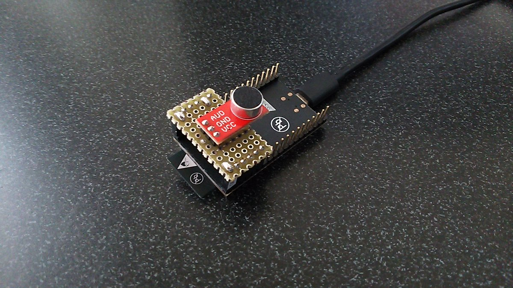
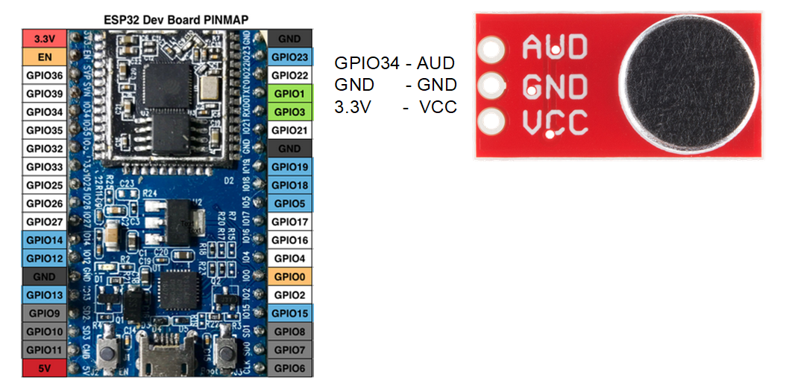
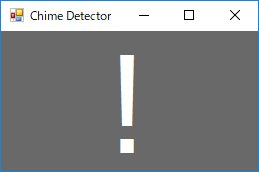

# esp32_ChimeDetector

## Prepare
- [ESP32-DevKitC](https://www.espressif.com/en/products/hardware/esp32-devkitc/overview)  : espressif
- [SparkFun Electret Microphone Breakout](https://www.sparkfun.com/products/12758) : sparkfun

## Wiring

## Development Environment and library
- [Arduino IDE](https://www.arduino.cc/en/main/software)
- [arduino-esp32](https://github.com/espressif/arduino-esp32)
- [arduinoFFT](https://github.com/kosme/arduinoFFT)
- [Visual Studio](https://www.microsoft.com/ja-jp/dev/default.aspx)

## How to use
You connect esp32_ChimeDetector to PC and start ChimeDetector.exe on PC.
When your chime rings, you are inform by alert with a sound.

## About ChimeDetector.exe
You can make it by Visual Studio easily.
1. Make a project with template for Visual C# Windows Form Application.
2. Add "SerialPort" and "Label" to Form Designer. Reshape them and set port name appropriately.
3. Double click "DataReceived" event of "SerialPort", and write as Form1Example.cs. Put wav file for alert sound.

## Note
Change sound detect condition to fit in your chime.
